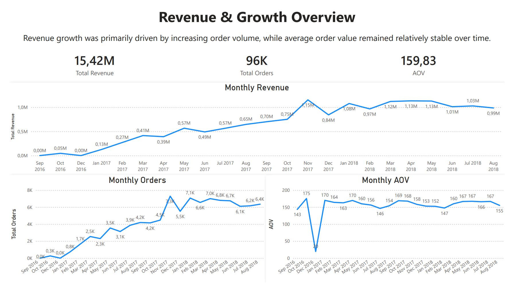
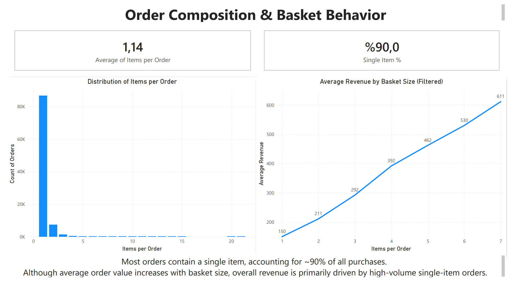
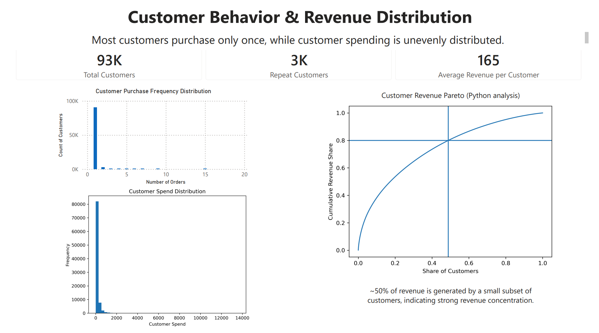
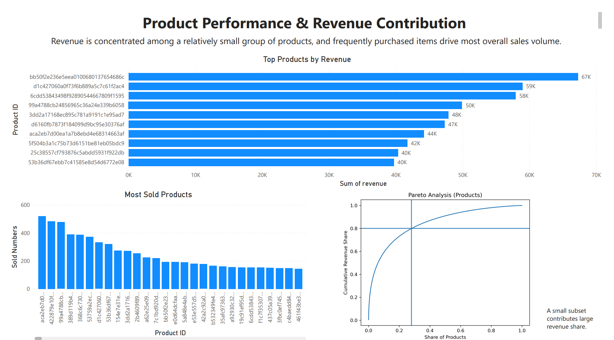

# Project_E-Commerce_Sales_Analysis

End-to-end analysis of ~100,000 orders: customer behavior, revenue trends, product performance, and Pareto analysis using SQL and Python, delivered as 4 interactive Power BI dashboards.

## Dataset

- Source: Olist Brazilian E-Commerce Dataset
- Link: https://www.kaggle.com/datasets/olistbr/brazilian-ecommerce
- Note: Raw data files are not included due to size constraints.

## Business Questions

- What drives overall revenue growth?
- Which customers contribute most to revenue, and how is the customer behavior?
- How is revenue distributed across products?
- Is revenue driven by high-value items or purchase frequency?
- Are there signs of customer or product concentration?

## Tools Used

- SQL (data cleaning, aggregation, analytical queries)
- Python (Pandas, Numpy, Matplotlib) (EDA, Pareto analysis, visualizations)
- Power BI (interactive dashboards)

## Key Insights

- Revenue growth was mainly driven by increasing order volume.
- Most customers purchased only once.
- Revenue was concentrated among a relatively small subset of products/customers.
- Business performance relied more on frequent low-item purchases, rather than high-price sales.
- A small group of products contributes a disproportionate share of total revenue.

## Business Recommendations

- Focus on increasing customer retention, as most customers currently purchase only once.
- Prioritize marketing strategies around high-frequency products, as revenue is driven more by purchase volume than high-ticket items.
- Improve engagement strategies for low-frequency customers to increase repeat purchases.
- Optimize product portfolio around top-performing products, as revenue is highly concentrated.

## Dashboard Preview

### Revenue & Growth Overview

### Order Composition & Basket Behavior

### Customer Behavior & Revenue Distribution

### Product Performance & Revenue Contribution

## Repository Structure

- /SQL_Scripts → 5 SQL scripts
- /Python_Script → 1 Python script
- /PowerBI → 4 Dashboard files
- /Images → Visual outputs from Python and Power BI
- README.md

## Notes

This project focuses on an end-to-end analytical workflow:
data cleaning → exploration → visualization → business interpretation
